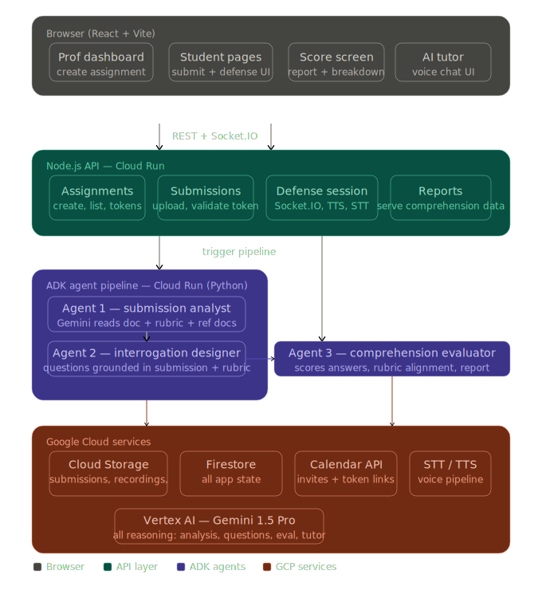

# Defendly — Final Build README
### Google Cloud Hackathon · Build With AI: The Agentic Frontier

> **You can generate the assignment. You can't fake the defense.**

---

## The Problem

Students submit AI-generated work. Tutors know. Students know tutors know.
Everyone is pretending — and the actual goal, *does the student understand the concept*, is lost entirely.

**Defendly's answer:** Don't detect AI usage. Verify understanding.

At the moment of submission, an agentic system reads the student's work, generates
oral defense questions grounded in both the submission *and* the professor's rubric,
conducts a live voice interrogation, and delivers a comprehension report to the instructor.

The submission stops mattering. Understanding is the only thing that gets graded.

---

## What We Deliberately Excluded

| Excluded | Why |
|----------|-----|
| User auth / registration | Hardcoded prof login; students use unique token URLs |
| Class / roster management UI | Hardcoded student list in config — not the demo's point |
| Google Meet bot | Custom browser voice UI is faster to build and better to demo |
| Email notifications | Google Calendar invite carries the link — that's enough |
| Re-submission | One token, one submission, by design |

---

## Core Flow (10 Steps)

```
1.  Prof logs in (hardcoded creds)
2.  Prof creates assignment:
      - title, description, deadline, difficulty
      - rubric (what concepts must be demonstrated)
      - optional reference documents (PDFs, notes)
3.  Google Calendar API sends each student a calendar invite
      with their unique one-time submission link
4.  Student opens link, uploads their assignment (PDF/doc)
      → file saved to Google Cloud Storage
      → submission metadata saved to Firestore
5.  ADK pipeline triggers automatically:
      Agent 1 (Analyst)   — Gemini reads the student's submission
                            + the prof's assignment brief + rubric
                            → extracts key concepts, claims, weak areas,
                              methodology, and rubric alignment gaps
      Agent 2 (Designer)  — Generates 3–5 oral questions that are:
                            • specific to what the student wrote
                            • constrained by the prof's rubric + topic scope
                            • impossible to answer without understanding
      Agent 3 (Evaluator) — Scores answers after defense,
                            generates comprehension report
6.  Student is notified: "Your defense session is ready"
7.  Student enters live voice defense (browser):
      - AI reads each question aloud (Cloud TTS)
      - Student answers via microphone
      - Real-time transcript appears on screen (Cloud STT)
      - Agent probes vague answers with follow-up questions
      - Entire session recorded → saved to GCS bucket
8.  Session ends → Agent 3 evaluates all answers
9.  Student sees their score + comprehension breakdown
10. Student can voice-chat with AI tutor to understand where they went wrong
    Prof dashboard shows all students: submission + score + full recording
```

---

## Architecture Diagrams



---



### Diagram 1 — System Structure (what lives where)

```
┌─────────────────────────────────────────────────────────────────────┐
│  BROWSER  (React + Vite)                                            │
│  ┌──────────────┐  ┌──────────────┐  ┌─────────────┐  ┌─────────┐ │
│  │ Prof dashboard│  │Student pages │  │Score screen │  │AI tutor │ │
│  │create assign. │  │submit+defense│  │report+breakdown│voice chat│ │
│  └──────────────┘  └──────────────┘  └─────────────┘  └─────────┘ │
└────────────────────────────┬────────────────────────────────────────┘
                   REST + Socket.IO
┌────────────────────────────▼────────────────────────────────────────┐
│  NODE.JS API  (Cloud Run)                                           │
│  ┌───────────┐  ┌────────────┐  ┌────────────────┐  ┌──────────┐  │
│  │Assignments│  │Submissions │  │Defense session │  │ Reports  │  │
│  │create,list│  │upload,token│  │Socket.IO,TTS,  │  │serve data│  │
│  │tokens     │  │validate    │  │STT             │  │          │  │
│  └───────────┘  └────────────┘  └────────────────┘  └──────────┘  │
└─────────┬────────────────────────────────┬──────────────────────────┘
    trigger pipeline                  read/write
┌──────────▼────────────────┐   ┌──────────▼──────────────────────────┐
│  ADK PIPELINE  (Cloud Run │   │  GOOGLE CLOUD SERVICES               │
│  Python)                  │   │  ┌──────────────┐  ┌─────────────┐  │
│  ┌─────────────────────┐  │   │  │Cloud Storage │  │  Firestore  │  │
│  │Agent 1 — analyst    │  │   │  │submissions,  │  │all app state│  │
│  │submission+rubric+   │  │   │  │recordings,   │  │             │  │
│  │ref docs → Gemini    │  │   │  │ref docs      │  │             │  │
│  └──────────┬──────────┘  │   │  └──────────────┘  └─────────────┘  │
│             ▼             │   │  ┌──────────────┐  ┌─────────────┐  │
│  ┌─────────────────────┐  │   │  │Calendar API  │  │  STT / TTS  │  │
│  │Agent 2 — designer   │  │   │  │invites+links │  │voice pipeline│  │
│  │questions grounded   │  │   │  └──────────────┘  └─────────────┘  │
│  │in submission+rubric │  │   │  ┌────────────────────────────────┐  │
│  └─────────────────────┘  │   │  │  Vertex AI — Gemini 1.5 Pro    │  │
│  ┌─────────────────────┐  │   │  │  all reasoning: analysis,      │  │
│  │Agent 3 — evaluator  │  │   │  │  questions, eval, tutor        │  │
│  │scores + rubric      │  │   │  └────────────────────────────────┘  │
│  │alignment report     │  │   └─────────────────────────────────────┘
│  └─────────────────────┘  │
└───────────────────────────┘
```

### Diagram 2 — End-to-End Data Flow

```
PHASE 1 — PROF SETUP
  Prof creates assignment
  (title, description, rubric, difficulty, deadline, optional ref docs)
       ├──► Google Calendar API  →  calendar invite + unique token URL per student
       └──► Firestore + GCS      →  assignment doc saved, ref doc files stored

PHASE 2 — STUDENT SUBMISSION
  Student opens token URL  →  sees assignment details + rubric
  Student uploads PDF/doc
       ├──► GCS bucket           →  submission file saved
       └──► Firestore            →  submission doc, status = "analyzing"
                                     pipeline trigger fired

PHASE 3 — ADK AGENT PIPELINE  (Vertex AI — Gemini 1.5 Pro)
  ┌─ Agent 1: Submission Analyst ──────────────────────────────────────┐
  │  Inputs:  student submission + assignment brief + rubric + ref docs │
  │  Output:  key concepts, claims, weak areas, rubric gaps, methodology│
  └────────────────────────────────────────────────────────────────────┘
                              ▼
  ┌─ Agent 2: Interrogation Designer ──────────────────────────────────┐
  │  Inputs:  analyst output + rubric + difficulty setting             │
  │  Rules:   every question must be (a) specific to the submission    │
  │           AND (b) relevant to the rubric/learning objectives       │
  │  Output:  3–5 questions[], each with follow-up probe               │
  └────────────────────────────────────────────────────────────────────┘
  Firestore updated: questions[], status = "ready_for_defense"

PHASE 4 — LIVE VOICE DEFENSE  (browser)
  Cloud TTS speaks each question aloud
  Student answers via microphone
  Cloud STT transcribes in real time → transcript displayed live
  Agent logic: vague answer → ask follow-up | good answer → next question
  Full session recorded via MediaRecorder → uploaded to GCS bucket

PHASE 5 — EVALUATION
  ┌─ Agent 3: Comprehension Evaluator ─────────────────────────────────┐
  │  Inputs:  transcript + voice signals + analysis + rubric           │
  │  Output:  score 0–100, understands[], weak_in[], cannot_justify[], │
  │           per-rubric verdict, recommendation                        │
  └────────────────────────────────────────────────────────────────────┘
  Report saved to Firestore

PHASE 6 — RESULTS
  Student:  score screen + comprehension breakdown + AI tutor (voice)
  Prof:     dashboard → all students → report + recording playback
```

### Key architectural decision: the question generation intersection

```
        Student's submission
               │
               │  what they actually wrote
               ▼
        ┌─────────────┐
        │  Agent 1    │ ─── extracts: concepts, claims,
        │  Analyst    │            weak areas, rubric gaps
        └──────┬──────┘
               │
               ▼
        ┌─────────────┐◄── Professor's rubric + assignment brief
        │  Agent 2    │    (what must be demonstrated to pass)
        │  Designer   │
        └──────┬──────┘
               │
        Questions that satisfy BOTH:
        • grounded in what the student wrote  (no generic topic Qs)
        • relevant to what the prof wanted tested  (no off-scope Qs)
```

---

## The Question Generation Rule

This is the core intellectual decision of the system.

Questions are generated with **two inputs, both required:**

**Input A — Student's submission** (what they actually wrote)
Agent 1 extracts: key concepts used, specific claims made, methodology chosen,
assumptions implied, weak or unsubstantiated sections.

**Input B — Professor's context** (what the assignment was actually about)
Includes: assignment description, learning objectives, rubric criteria,
any reference documents or notes the prof uploaded.

**The intersection is where questions come from.**

A question is only valid if it satisfies both:
- It references something *specific* in the student's submission (not generic topic questions)
- It is *relevant* to the rubric and learning objectives the prof defined

Example: Prof asks for an essay on gradient descent. Student submits an essay that
mentions "we set learning rate to 0.01." The rubric says "must justify hyperparameter choices."
A valid question: *"You chose a learning rate of 0.01 in your submission — what would happen
to convergence if you used 0.1 instead?"*
An invalid question: *"What is gradient descent?"* (generic, not grounded in their work)
An invalid question: *"Explain backpropagation"* (not in rubric scope, not in their submission)

---

## Tech Stack

### Google Cloud

| Service | Purpose |
|---------|---------|
| Vertex AI — Gemini 1.5 Pro | All AI reasoning: document analysis, question generation, answer evaluation, AI tutor |
| Agent Development Kit (ADK) | Multi-agent orchestration, A2A communication |
| Cloud Run | Hosts Node.js API + Python agent service |
| Cloud Storage (GCS) | Student submission files, reference documents, session recordings |
| Firestore | All application state |
| Cloud Speech-to-Text | Transcribes student voice in real time |
| Cloud Text-to-Speech | AI speaks questions and tutor responses aloud |
| Google Calendar API | Sends assignment invites with unique student links |

### Backend — Node.js (Express on Cloud Run)

| Package | Purpose |
|---------|---------|
| `express` | REST API |
| `socket.io` | Real-time defense session |
| `firebase-admin` | Firestore access |
| `googleapis` | Calendar API |
| `@google-cloud/storage` | GCS file operations |
| `@google-cloud/speech` | STT streaming |
| `@google-cloud/text-to-speech` | TTS synthesis |
| `multer` | File upload handling |
| `uuid` | Token generation |

### Agent Service — Python (ADK on Cloud Run)

| Package | Purpose |
|---------|---------|
| `google-adk` | Agent framework |
| `google-cloud-aiplatform` | Vertex AI / Gemini API |
| `google-cloud-firestore` | Read/write pipeline state |
| `google-cloud-storage` | Fetch submission files |
| `pydantic` | Typed agent I/O schemas |
| `pypdf2` | Extract text from PDF submissions |

### Frontend — React + Vite

| Package | Purpose |
|---------|---------|
| `react` + `vite` | SPA framework |
| `tailwindcss` | Styling |
| `react-router-dom` | Page routing |
| `@tanstack/react-query` | API state + polling |
| `axios` | HTTP client |
| `socket.io-client` | Defense session real-time |
| Web Speech API (browser native) | Mic capture + live transcript |
| MediaRecorder API (browser native) | Full session recording |

---

## Project File Structure

```
defendly/
│
├── frontend/                          ← Person B owns this
│   ├── src/
│   │   ├── pages/
│   │   │   ├── ProfLogin.jsx          hardcoded creds check, sets session flag
│   │   │   ├── ProfDashboard.jsx      assignment creator + student overview
│   │   │   ├── StudentLanding.jsx     token validation, assignment details, upload
│   │   │   ├── DefenseSession.jsx     live voice defense UI
│   │   │   ├── ScoreScreen.jsx        comprehension result + breakdown
│   │   │   └── AITutor.jsx            post-defense voice chat
│   │   ├── components/
│   │   │   ├── VoiceWave.jsx          animated mic waveform (CSS only)
│   │   │   ├── ScoreCard.jsx          understands / weak / cannot justify sections
│   │   │   ├── Timer.jsx              countdown, turns amber → red
│   │   │   ├── TranscriptFeed.jsx     live STT text appearing during defense
│   │   │   └── RecordingPlayer.jsx    playback in prof dashboard
│   │   └── lib/
│   │       ├── api.js                 axios instance, all endpoint calls
│   │       ├── socket.js              socket.io client setup
│   │       └── mockData.js            mock responses for offline dev (Person B)
│
├── backend/                           ← Person A owns this
│   ├── routes/
│   │   ├── assignments.js             POST /api/assignments
│   │   │                              GET  /api/assignments
│   │   ├── submissions.js             GET  /api/submit/:token
│   │   │                              POST /api/submit/:token
│   │   │                              GET  /api/submit/:token/status
│   │   └── reports.js                 GET  /api/report/:sessionId
│   ├── services/
│   │   ├── calendar.js                Google Calendar invite sender
│   │   ├── storage.js                 GCS upload + signed URL generator
│   │   ├── tts.js                     text → audio (Cloud TTS)
│   │   ├── stt.js                     audio → transcript (Cloud STT)
│   │   └── pipeline.js                HTTP call to ADK service to start pipeline
│   ├── socket/
│   │   └── defenseSession.js          Socket.IO: question flow, answer capture,
│   │                                  recording finalization, eval trigger
│   ├── config.js                      PROF + STUDENTS hardcoded here
│   └── index.js
│
├── agents/                            ← Person A owns this
│   ├── orchestrator.py                main pipeline runner, Firestore state machine
│   ├── analyst.py                     Agent 1 — submission + assignment analysis
│   ├── designer.py                    Agent 2 — question generation
│   ├── evaluator.py                   Agent 3 — comprehension scoring + report
│   ├── prompts.py                     all Gemini prompt templates
│   ├── schemas.py                     Pydantic models for all agent I/O
│   └── main.py                        Flask endpoint POST /run-pipeline
│
└── .env
```

---

## Firestore Schema

```
/assignments/{assignmentId}
  title:            string
  description:      string          ← shown to student on submission page
  rubric:           string          ← learning objectives, what must be demonstrated
  referenceDocsGcs: string[]        ← GCS URLs of any prof-uploaded reference files
  difficulty:       "easy" | "medium" | "hard"
  deadline:         timestamp
  createdAt:        timestamp
  studentTokens:    {
    [token: string]: {
      name:  string
      email: string
      used:  boolean
    }
  }

/submissions/{submissionId}
  assignmentId:     string
  studentToken:     string
  studentName:      string
  gcsFileUrl:       string          ← uploaded submission
  status:           "uploaded" | "analyzing" | "ready_for_defense" | "defending" | "complete"
  analysis:         AnalystOutput   ← filled by Agent 1
  questions:        Question[]      ← filled by Agent 2
  createdAt:        timestamp

/defense_sessions/{sessionId}
  submissionId:     string
  studentName:      string
  status:           "active" | "complete"
  transcript:       [               ← filled turn by turn during defense
    {
      questionIndex: number
      questionText:  string
      answerText:    string
      followUpAsked: boolean
      voiceSignals:  { hesitationCount, fillerWordCount, avgLatencyMs, confidenceScore }
    }
  ]
  recordingGcsUrl:  string          ← uploaded at session end
  startedAt:        timestamp
  endedAt:          timestamp

/reports/{reportId}
  sessionId:        string
  submissionId:     string
  assignmentId:     string
  studentName:      string
  overallScore:     number          ← 0–100
  understands:      string[]        ← concepts clearly grasped
  weakIn:           string[]        ← surface-level knowledge
  cannotJustify:    string[]        ← claims they could not defend
  rubricAlignment:  {               ← per-rubric-criterion verdict
    criterion: string
    verdict: "demonstrated" | "partial" | "not demonstrated"
  }[]
  recommendation:   string          ← one of three verdicts (see Evaluator prompt)
  summary:          string          ← 2-sentence plain English for prof
  generatedAt:      timestamp
```

---

## API Reference

```
# Assignment management
POST  /api/assignments
      body: { title, description, rubric, difficulty, deadline,
               referenceDocUrls[] (optional GCS paths) }
      → creates assignment, generates student tokens, sends Calendar invites
      → returns { assignmentId, tokens[] }

GET   /api/assignments
      → returns all assignments with student statuses (prof dashboard)

# Student submission flow
GET   /api/submit/:token
      → validates token (404 if invalid/used)
      → returns { assignmentTitle, description, rubric, deadline, studentName }

POST  /api/submit/:token
      body: multipart/form-data — file field
      → uploads to GCS
      → marks token as used
      → saves submission to Firestore
      → triggers ADK pipeline (async)
      → returns { submissionId }

GET   /api/submit/:token/status
      → returns { status, sessionId? }
      → frontend polls this every 3s until status = "ready_for_defense"

# Defense session (also via Socket.IO, see below)
GET   /api/session/:sessionId
      → returns { questions[], studentName, assignmentTitle }

POST  /api/session/:sessionId/end
      body: { recordingGcsUrl }
      → marks session complete
      → triggers Agent 3 evaluation
      → returns { reportId }

# Reports
GET   /api/report/:reportId
      → returns full report (used by both score screen and prof dashboard)

# Internal
POST  /internal/pipeline/start
      body: { submissionId }
      → called by backend after submission saved
      → forwards to Python agent service at /run-pipeline
```

### Socket.IO Events — Defense Session

```
Namespace: /defense

Client → Server:
  join_session     { sessionId }                      ← on page load
  answer_done      { sessionId, transcript: string }  ← student pressed "done"
  voice_chunk      { sessionId, audio: Buffer }        ← if using Cloud STT stream

Server → Client:
  session_ready    { questions[], totalCount }         ← on join
  ask_question     { text, index, total }              ← AI asks question
  ask_followup     { text }                            ← AI probes vague answer
  transcript_live  { text }                            ← real-time STT update
  session_complete { reportId }                        ← all questions done
```

---

## Hardcoded Config

```javascript
// backend/config.js
export const PROF = {
  email:    "prof@university.edu",
  password: "defendly2024",           // simple client-side check, no JWT needed
  name:     "Dr. Sharma"
}

export const STUDENTS = [
  { name: "Alex Chen",    email: "alex@uni.edu"    },
  { name: "Priya Mehta",  email: "priya@uni.edu"   },
  { name: "Jordan Blake", email: "jordan@uni.edu"  },
]

// Tokens are generated fresh per assignment:
// import { v4 as uuid } from 'uuid'
// studentTokens = Object.fromEntries(STUDENTS.map(s => [uuid(), { ...s, used: false }]))
```

---

## Agent Prompts

### Agent 1 — Submission Analyst

```python
ANALYST_PROMPT = """
You are analyzing a student's submitted assignment in the context of what the
professor asked for. Your output will be used to generate targeted oral defense
questions that test genuine understanding.

Return ONLY valid JSON. No preamble, no markdown fences.

{
  "key_concepts": [
    "concepts the student explicitly discusses"
  ],
  "claims": [
    "specific conclusions or arguments the student makes"
  ],
  "methodology": "how the student approached the problem",
  "weak_areas": [
    "sections that are vague, unsubstantiated, or logically incomplete"
  ],
  "assumptions": [
    "things the student assumed without justifying"
  ],
  "rubric_gaps": [
    "rubric criteria that the submission does not clearly address"
  ],
  "defensible_sections": [
    "specific passages or claims that are worth probing in a defense"
  ]
}

--- PROFESSOR'S ASSIGNMENT BRIEF ---
Title: {ASSIGNMENT_TITLE}
Description: {ASSIGNMENT_DESCRIPTION}
Rubric / Learning objectives: {RUBRIC}
Reference material summary (if any): {REFERENCE_SUMMARY}

--- STUDENT'S SUBMISSION ---
{SUBMISSION_TEXT}
"""
```

### Agent 2 — Interrogation Designer

```python
QUESTION_PROMPT = """
Generate exactly {N} oral defense questions for this student's submission.
Difficulty level: {DIFFICULTY}

STRICT RULES — every question must satisfy ALL of the following:
1. It references something SPECIFIC in the student's submission (quote or paraphrase
   the exact section it targets in "section_reference")
2. It is RELEVANT to the professor's rubric or learning objectives
3. It is IMPOSSIBLE to answer well without having understood and written the work
4. Generic topic questions are FORBIDDEN ("What is X?", "Explain Y" with no submission anchor)
5. Each question must have a follow-up for when the student answers vaguely

For difficulty "easy":   test whether they understand their own conclusions
For difficulty "medium": probe their methodology and justify specific choices
For difficulty "hard":   challenge assumptions, ask what-if variants, expose gaps

Return ONLY valid JSON. No preamble, no markdown fences.

{
  "questions": [
    {
      "text": "the question asked aloud to the student",
      "section_reference": "the specific part of their submission this targets",
      "rubric_criterion": "which rubric point this tests",
      "follow_up": "if their answer is vague or evasive, ask this"
    }
  ]
}

--- PROFESSOR'S CONTEXT ---
Rubric: {RUBRIC}
Learning objectives: {ASSIGNMENT_DESCRIPTION}

--- SUBMISSION ANALYSIS ---
{ANALYSIS_JSON}
"""
```

### Agent 3 — Comprehension Evaluator

```python
EVAL_PROMPT = """
Evaluate a student's oral defense performance and produce a comprehension report.

You have:
- The professor's rubric and assignment context
- The student's original submission analysis
- Every question asked, with the student's transcribed answer and voice signals
- Voice signals per answer: hesitation count, filler word count, avg response
  latency in ms, estimated confidence score (0–1)

Assess whether the student genuinely understands the work they submitted.
A student who authored their own work will: answer quickly, refer to specific
details, self-correct naturally, and give consistent reasoning across questions.
A student who did not will: hesitate on specifics, give textbook definitions
instead of submission-specific answers, contradict themselves, and struggle with
follow-ups.

Return ONLY valid JSON. No preamble, no markdown fences.

{
  "overall_score": <0-100>,
  "understands": [
    "topic or concept they clearly grasped, with brief evidence"
  ],
  "weak_in": [
    "area where their knowledge was surface-level, with brief evidence"
  ],
  "cannot_justify": [
    "specific claim from their submission they could not defend"
  ],
  "rubric_alignment": [
    {
      "criterion": "rubric criterion text",
      "verdict": "demonstrated | partial | not demonstrated",
      "evidence": "brief quote or paraphrase from their answer"
    }
  ],
  "recommendation": "one of exactly: Clearly authored | Possibly AI-assisted but understands | AI-generated, does not understand",
  "summary": "2 sentences of plain English for the professor"
}

--- PROFESSOR'S CONTEXT ---
Rubric: {RUBRIC}

--- SUBMISSION ANALYSIS ---
{ANALYSIS_JSON}

--- DEFENSE TRANSCRIPT ---
{QA_JSON}
"""
```

### AI Tutor System Prompt

```python
TUTOR_SYSTEM = """
You are an academic tutor reviewing a student's oral defense session with them.
This is a voice conversation — keep your responses concise (2–4 sentences max),
direct, and spoken-word natural. No bullet points, no lists.

You know exactly:
- What the assignment asked for
- What the student submitted
- Every question they were asked
- Their exact answers
- Where their understanding broke down

When they ask where they went wrong, be SPECIFIC. Reference their actual answers,
not generic advice. For example: "When you were asked about learning rate, you
said '{their answer}' — the gap there is that you didn't connect it to
convergence speed. Here's what a complete answer looks like: ..."

Help them understand the concept gap, not just the score. Be encouraging but honest.

--- ASSIGNMENT ---
{ASSIGNMENT_DESCRIPTION}
Rubric: {RUBRIC}

--- COMPREHENSION REPORT ---
{REPORT_JSON}

--- DEFENSE Q&A ---
{QA_JSON}
"""
```

---

## Voice Defense — Technical Implementation

### How the browser session works

```
1. Student opens /defense/:sessionId
2. React fetches questions from API → cached locally
3. MediaRecorder starts (records full session audio for GCS)
4. Socket.IO connects to /defense namespace, emits join_session
5. Server emits ask_question { text, index: 1, total: 4 }
6. Frontend calls Cloud TTS → plays audio through Web Audio API
7. Student answers:
     Option A (simpler):  Web Speech API captures speech → live transcript
                          Student clicks "Done" → transcript sent via answer_done
     Option B (better):   MediaRecorder chunks → socket voice_chunk events
                          Server streams to Cloud STT → transcript_live events back
8. Server receives answer → saves to Firestore transcript array
9. Agent logic decides: good answer → next question
                        vague answer → emit ask_followup
                        all done    → emit session_complete
10. On session_complete:
     - MediaRecorder stops → blob uploaded to GCS
     - POST /api/session/:id/end with recordingGcsUrl
     - Agent 3 evaluates → report saved → reportId returned
     - Frontend navigates to /score/:reportId
```

### Voice stack recommendation

Start with **Option A** (Web Speech API + Cloud TTS). Get it working end-to-end first.
Upgrade to Option B only if time allows after everything else is done.

```javascript
// Option A — browser STT (simplest, works for demo)
const recognition = new window.SpeechRecognition()
recognition.continuous = true
recognition.interimResults = true
recognition.onresult = (e) => {
  const transcript = Array.from(e.results).map(r => r[0].transcript).join('')
  setLiveTranscript(transcript)
}

// Cloud TTS — AI speaks the question
// POST /api/tts { text } → returns { audioBase64 }
const audio = new Audio(`data:audio/mp3;base64,${audioBase64}`)
audio.play()
```

---

## Assignment Creation — Prof UI Details

When creating an assignment, the prof fills in:

| Field | Type | Required | Notes |
|-------|------|----------|-------|
| Title | text | yes | shown to student |
| Description | textarea | yes | what the assignment is about, scope, context |
| Rubric | textarea | yes | learning objectives, what must be demonstrated to pass |
| Difficulty | select | yes | easy / medium / hard — controls question depth |
| Deadline | datetime | yes | shown on Calendar invite and student page |
| Reference documents | file upload (multi) | no | PDFs, notes, slides — fed to Agent 1 context |

Reference documents are stored in GCS and their text is extracted (via Gemini or pypdf2)
and included in the Agent 1 prompt as `{REFERENCE_SUMMARY}`. This allows the agent to
ask questions that reference course material, expected methodologies, or specific
frameworks the professor wants tested.

---

## Two-Person Build Plan

### Person A — Backend + Agents

**Hour 0–2: Setup**
- [ ] GCP project, enable all APIs (Vertex AI, STT, TTS, Calendar, GCS, Firestore, Cloud Run)
- [ ] Download service account JSON, set up Calendar OAuth2 refresh token
- [ ] `npm init` backend, install all packages
- [ ] `pip install` agent packages
- [ ] Firestore: create collections manually or via script
- [ ] GCS: create bucket, set CORS for browser uploads

**Hour 2–6: Submission + Storage layer**
- [ ] `GET /api/submit/:token` — validate token, return assignment + student name
- [ ] `POST /api/submit/:token` — accept file, upload to GCS, mark token used, save Firestore doc
- [ ] `GET /api/submit/:token/status` — return status field from Firestore
- [ ] `POST /api/assignments` — create assignment doc, generate tokens, send Calendar invites
- [ ] `GET /api/assignments` — return all assignments with per-student status
- [ ] Reference doc upload to GCS (optional field in POST /api/assignments)

**Hour 6–12: Agent pipeline**
- [ ] `schemas.py` — Pydantic models: `AnalystOutput`, `QuestionSet`, `Question`, `EvalReport`
- [ ] `prompts.py` — all three prompts templated as Python f-strings
- [ ] `analyst.py` — fetch submission from GCS, extract text, call Gemini, parse JSON output
- [ ] `designer.py` — takes `AnalystOutput` + assignment context, calls Gemini, returns `QuestionSet`
- [ ] `evaluator.py` — takes transcript + voice signals + analysis, calls Gemini, returns `EvalReport`
- [ ] `orchestrator.py` — runs agents in sequence, writes to Firestore at each step:
  ```
  submission.status = "analyzing"
  → run analyst → save submission.analysis
  → run designer → save submission.questions
  → submission.status = "ready_for_defense"
  [after defense]
  → run evaluator → save /reports doc
  ```
- [ ] `main.py` — Flask server, `POST /run-pipeline { submissionId }` triggers orchestrator
- [ ] `pipeline.js` (backend service) — HTTP call to Python service

**Hour 12–18: Voice session**
- [ ] `tts.js` — `POST /api/tts { text }` → Cloud TTS → return base64 audio
- [ ] `stt.js` — if doing Option B: streaming STT via socket.io voice chunks
- [ ] `defenseSession.js` (Socket.IO) — full defense flow handler:
  - On `join_session`: fetch questions, emit first `ask_question`
  - On `answer_done`: save answer to Firestore transcript, decide next/followup/end
  - On `session_complete`: emit to client, wait for recording URL
- [ ] `POST /api/session/:id/end` — save recordingGcsUrl, trigger evaluator

**Hour 18–21: Reports + Deploy**
- [ ] `GET /api/report/:reportId` — return full report doc
- [ ] Cloud Run deploy: Node.js service + Python service as separate services
- [ ] Wire `.env` to GCP Secret Manager or just env vars on Cloud Run
- [ ] End-to-end smoke test with a real PDF and voice session

**Hour 21–24: Integration + fixes**
- [ ] Fix anything broken from Person B's integration test
- [ ] Add basic error handling (pipeline failure → status = "error", show message)

---

### Person B — Frontend

**Hour 0–2: Setup**
- [ ] `npm create vite@latest defendly-ui -- --template react`
- [ ] Install all packages, configure TailwindCSS
- [ ] Set up React Router routes:
  `/login` → `/dashboard` → `/submit/:token` → `/defense/:sessionId` → `/score/:reportId` → `/tutor/:reportId`
- [ ] Create `mockData.js` with fake API responses for every endpoint (work offline)
- [ ] Create `api.js` with all axios calls stubbed (swap base URL at integration time)

**Hour 2–7: Prof dashboard**
- [ ] `ProfLogin.jsx` — email + password form, compare to hardcoded PROF config, set `sessionStorage.prof = true`
- [ ] `ProfDashboard.jsx`:
  - Left: assignment list (click to expand), "New assignment" button
  - Right: student status table — name, status badge, score (if done), "View report" link
  - Assignment creation form (inline or modal):
    - Title, description, rubric textarea, difficulty select, deadline picker
    - Multi-file upload for reference documents
    - Submit → `POST /api/assignments`
- [ ] `ScoreCard.jsx`:
  - Three labeled sections: "Understands" (green), "Weak in" (amber), "Cannot justify" (red)
  - Per-rubric-criterion verdict badges
  - Overall score as large number
- [ ] `RecordingPlayer.jsx` — HTML `<audio>` element with GCS signed URL, basic controls

**Hour 7–11: Student submission UI**
- [ ] `StudentLanding.jsx`:
  - Calls `GET /api/submit/:token` on load (redirect to error page if invalid/used)
  - Show: assignment title, description, rubric, deadline countdown
  - Drag-and-drop file upload zone with progress bar
  - On submit: `POST /api/submit/:token`, then disable form, show "Submission received. Preparing your defense..."
  - Start polling `GET /api/submit/:token/status` every 3 seconds
  - When status = `ready_for_defense`: show "Start your defense session" button → navigate to `/defense/:sessionId`

**Hour 11–17: Defense session UI**
- [ ] `DefenseSession.jsx` — this is the most important screen, make it look great:
  - Full-screen, voice-first layout (dark mode recommended)
  - Header: assignment title, student name, `Timer.jsx` (10 min countdown)
  - Center: current question text (large, readable)
    - Question index pill: "Question 2 of 4"
    - Follow-up label if applicable: "Follow-up:"
  - Bottom: `VoiceWave.jsx` + "Done answering" button
  - Side strip: `TranscriptFeed.jsx` — live transcript scrolling as student speaks
- [ ] `VoiceWave.jsx` — 5 bars with CSS keyframe animation, pulses when mic is active
- [ ] `Timer.jsx` — `setInterval` countdown, CSS class changes at 3 min and 1 min
- [ ] `TranscriptFeed.jsx` — scrolling div, appends text from socket `transcript_live` events
- [ ] Wire Socket.IO:
  - `join_session` on mount
  - Listen for `ask_question` → update question state + call TTS API + play audio
  - Listen for `ask_followup` → same
  - Listen for `session_complete` → stop recording, upload blob, navigate to score
  - Emit `answer_done` with transcript on button click
- [ ] `MediaRecorder` setup:
  ```javascript
  const recorder = new MediaRecorder(stream)
  const chunks = []
  recorder.ondataavailable = e => chunks.push(e.data)
  recorder.onstop = async () => {
    const blob = new Blob(chunks, { type: 'audio/webm' })
    // upload to GCS via signed URL or /api/upload-recording endpoint
    // then POST /api/session/:id/end with recordingGcsUrl
  }
  ```

**Hour 17–21: Score screen + AI tutor**
- [ ] `ScoreScreen.jsx`:
  - Animated count-up to `overallScore` (use `requestAnimationFrame`, 1.5s)
  - Render `ScoreCard.jsx` with report data
  - Recommendation badge (color-coded: green / amber / red)
  - "Talk to AI tutor" button → navigate to `/tutor/:reportId`
- [ ] `AITutor.jsx`:
  - Fetch report on load (passed as context to every Gemini call)
  - Chat bubble UI: user bubbles (right, voice transcript) + AI bubbles (left, TTS response)
  - Mic button at bottom: hold to speak, release to send
  - Each user turn: STT → `POST /api/tutor/chat { reportId, message, history }` → TTS response played
  - Show transcript of AI response as text while it speaks

**Hour 21–24: Integration + polish**
- [ ] Swap `mockData.js` for real API base URL (`import.meta.env.VITE_API_URL`)
- [ ] Full flow test with Person A's deployed API
- [ ] Fix broken states: invalid token, pipeline error, empty report
- [ ] Add loading skeletons to dashboard and score screen
- [ ] Final visual pass: consistent spacing, no broken mobile layout

---

## Build Timeline

```
Hour  0–2   BOTH   GCP setup, project scaffolds, mock data contract agreed
Hour  2–6   A      Submission API + GCS + Calendar invites + token system
            B      ProfLogin + ProfDashboard + assignment creation form
Hour  6–10  A      ADK agents: analyst (1) + designer (2) — get output printing to console
            B      StudentLanding + file upload + status polling
Hour 10–14  A      ADK evaluator (3) + orchestrator + Firestore state machine
            B      DefenseSession UI — voice waveform, timer, transcript feed (against mock)
Hour 14–18  A      Voice session: TTS/STT endpoints + Socket.IO defense handler
            B      ScoreScreen + AITutor UI
Hour 18–20  A      Cloud Run deploy (Node.js + Python), end-to-end smoke test
            B      Wire all frontend to real API, test full flow
Hour 20–22  BOTH   Integration debugging, edge case fixes
Hour 22–24  BOTH   Demo rehearsal, final UI polish, prep talking points
```

---

## Environment Setup

### Enable GCP APIs

```bash
gcloud services enable \
  aiplatform.googleapis.com \
  texttospeech.googleapis.com \
  speech.googleapis.com \
  calendar-json.googleapis.com \
  storage.googleapis.com \
  firestore.googleapis.com \
  run.googleapis.com \
  cloudbuild.googleapis.com
```

### Backend

```bash
cd backend
npm install express firebase-admin googleapis \
  @google-cloud/speech @google-cloud/text-to-speech \
  @google-cloud/storage socket.io cors dotenv multer uuid
```

### Agent Service

```bash
cd agents
pip install google-adk google-cloud-aiplatform \
  google-cloud-firestore google-cloud-storage \
  pydantic python-dotenv pypdf2 flask
```

### Frontend

```bash
cd frontend
npm create vite@latest . -- --template react
npm install tailwindcss @tailwindcss/vite \
  react-router-dom @tanstack/react-query \
  axios socket.io-client lucide-react
```

### .env (Backend)

```env
GOOGLE_PROJECT_ID=defendly-hackathon
GOOGLE_APPLICATION_CREDENTIALS=./service-account.json
VERTEX_AI_LOCATION=us-central1
GEMINI_MODEL=gemini-1.5-pro-002
GCS_BUCKET=defendly-submissions
AGENT_SERVICE_URL=https://defendly-agents-xxxx.run.app
GOOGLE_CLIENT_ID=xxx
GOOGLE_CLIENT_SECRET=xxx
GOOGLE_CALENDAR_REFRESH_TOKEN=xxx
BASE_URL=https://defendly-api-xxxx.run.app
PORT=8080
```

### .env (Frontend)

```env
VITE_API_URL=https://defendly-api-xxxx.run.app
VITE_SOCKET_URL=https://defendly-api-xxxx.run.app
```

---

## Demo Script (60 Seconds)

**0:00–0:10 — Prof creates assignment**
Log in. Click "New Assignment."
Fill: "Explain gradient descent and justify your hyperparameter choices."
Rubric: "Must demonstrate understanding of learning rate, convergence, and momentum."
Difficulty: Hard. Add a reference PDF (lecture notes on optimizers). Hit create.
Calendar invites sent automatically to three students.

**0:10–0:18 — Student submits**
Open the calendar invite as a student. Landing page shows assignment details + rubric.
Drop in a clearly AI-generated PDF. Submit.
Screen shows: "Analyzing your submission..."

**0:18–0:27 — Questions appear**
Page transitions: "Your defense session is ready."
Pause here. Show the 3 generated questions — let judges read them.
Point out: these questions reference the student's *exact* methodology and the *rubric criteria*.
Not "what is gradient descent?" — but "you used 0.01 as your learning rate in section 2 — what happens to convergence if you double it?"

**0:27–0:42 — Live voice defense**
Join session. Dark screen. Timer starts. AI voice reads Q1 aloud.
Student answers (poorly — it's AI-generated work). Transcript appears in real time.
AI detects vague answer, asks follow-up probe. Student stumbles.
Move to Q2. Show the same pattern.

**0:42–0:50 — Score reveal**
Session ends. Score counts up: 31/100.
Breakdown: "Understands: basic definition of gradient | Weak in: learning rate intuition, momentum | Cannot justify: convergence claim in section 2."
Rubric alignment: all three criteria — "not demonstrated."
Recommendation badge: "AI-generated, does not understand."

**0:50–0:57 — AI tutor**
Student asks: "What did I get wrong on the learning rate question?"
AI responds in voice: "When I asked about learning rate, you said [their answer].
The gap is that you didn't connect rate to step size and convergence speed. Here's what that looks like..."

**0:57–1:00 — Prof dashboard**
Switch to prof view. Three students, one score visible. Click — see full transcript, recording, rubric verdict per criterion.

**Final line:**
> "The submission was irrelevant the moment this system read it."

---

## Judging Checklist

| Track Criterion | How Defendly Delivers |
|----------------|----------------------|
| Agentic workflow | 3-agent ADK pipeline with A2A handoffs; interrogator agent makes autonomous branching decisions during live defense |
| Google Cloud Platform | Vertex AI (Gemini 1.5 Pro), Cloud STT, Cloud TTS, Cloud Run, GCS, Firestore, Calendar API — entire stack is GCP |
| Long-context reasoning | Gemini reads full submission + assignment brief + reference documents together in a single context window |
| Bridges AI and real world | Solves an active, unsolved, daily problem for every educator on the planet |
| AI as active collaborator | Agent adapts in real time — follow-up questions based on answer quality; tutor references exact student answers |
| Functional demo | End-to-end in 60 seconds, every step visible, no hand-waving |

---

*Defendly — Built for Google Cloud Hackathon: Build With AI — The Agentic Frontier*
*2-person team · Vertex AI + ADK + GCS + Calendar API + Cloud STT/TTS + React*