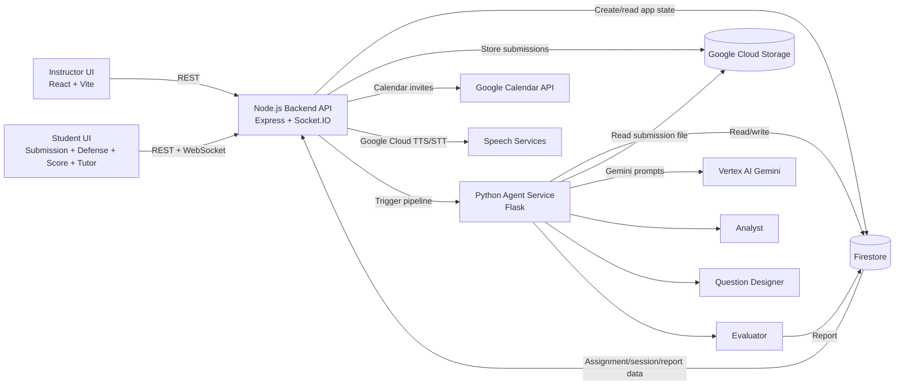

# AfterProof

AfterProof is an AI-powered oral defense platform for academic submissions. Instead of trying to detect whether a student used AI, it verifies whether the student actually understands the work they submitted.

The current implementation lets an instructor create an assignment, send one-time submission links to a fixed student list, analyze each uploaded submission with Gemini, generate targeted defense questions, run a live oral defense, evaluate the answers, and produce a review report for both student and instructor.

## Overview

- Problem: written submissions are easy to generate, but much harder to genuinely explain.
- Product approach: move evaluation from static submission review to an adaptive, submission-grounded defense.
- AI role: the system reads the submission, reasons over assignment context, generates follow-up questions, evaluates demonstrated understanding, and helps the student learn from the outcome.
- Live deployment:
  - Frontend: `https://defendly.web.app`
  - Backend API: `https://defendly-api-513251403701.us-central1.run.app`
  - Agent service: `https://defendly-agents-513251403701.us-central1.run.app`

## System Structure

The project is split into three deployable services:

1. `frontend/`: React + Vite application for instructor, student, report, and tutor flows
2. `backend/`: Node.js API for assignments, submissions, session management, reports, TTS, STT, tutor chat, and Socket.IO coordination
3. `agents/`: Python Flask service that runs the Gemini-based pipeline for analysis, question design, and evaluation

## End-to-End Flow

1. Instructor logs in with demo credentials.
2. Instructor creates an assignment with title, description, difficulty, deadline, and optional reference document URLs.
3. Backend stores the assignment in Firestore, generates one-time student tokens, and attempts to send Google Calendar invites with the submission link.
4. Student opens `/submit/:token`, views the assignment, and uploads a PDF or Word document.
5. Backend stores the uploaded file in Google Cloud Storage, creates a Firestore `submissions` document, marks the token as used, and triggers the Python agent service.
6. Agent pipeline:
   - Analyst agent extracts concepts, claims, methodology, weak areas, assumptions, rubric gaps, and defensible sections from the submission.
   - Designer agent generates exactly 3 submission-grounded oral defense questions plus concise follow-ups.
   - Backend marks the submission `ready_for_defense` and creates a `defense_sessions` record.
7. Student is redirected into the live defense session.
8. The backend synthesizes each question with Google Cloud Text-to-Speech, the browser records the student's answer, and the backend transcribes it with Google Cloud Speech-to-Text before storing the answer in Firestore.
9. If an answer is too vague, the socket handler asks the question-specific follow-up. A defense currently stops after a maximum of 4 asks.
10. When the session ends, backend calls the evaluator agent, which scores understanding and generates student/professor-facing summaries.
11. Student sees the score screen and can open an AI tutor chat grounded in their report and transcript.
12. Instructor dashboard shows per-student progress and opens the final report in professor view.

## Architecture




## How The AI Logic Works

The core product decision is that questions are generated at the intersection of:

- what the student actually wrote
- what the instructor actually asked them to demonstrate

This is enforced in code through the prompts in [`agents/core/prompts.py`](/Users/sivasankernp/Desktop/defendly/agents/core/prompts.py):

- `ANALYST_PROMPT` extracts the structure of the submission
- `QUESTION_PROMPT` requires every question to reference a specific section of the submission and align to the assignment context
- `EVAL_PROMPT` scores whether the student appears to understand their own work, not whether the paper itself is academically perfect

The pipeline is orchestrated in [`agents/core/orchestrator.py`](/Users/sivasankernp/Desktop/defendly/agents/core/orchestrator.py).

## Core Workflow

The main workflow is implemented as a multi-step AI pipeline:

1. Submission ingestion: uploaded work is stored in GCS and registered in Firestore.
2. Analyst step: Gemini extracts key concepts, claims, methodology, weak areas, assumptions, rubric gaps, and defensible sections.
3. Designer step: Gemini generates exactly three oral defense questions with targeted follow-ups, constrained by both the submission and the assignment context.
4. Session orchestration: the backend coordinates the live defense over Socket.IO, uses Google Cloud TTS/STT during the session, and records each answer turn in Firestore.
5. Evaluator step: Gemini reviews the full Q&A transcript plus prior analysis and produces a structured understanding report.
6. Tutor step: a separate Gemini-backed chat uses the report, transcript, and analysis to help the student understand where they struggled.

## Stack

### Frontend

- React 19
- React Router 7
- Vite 8
- Tailwind CSS 4
- Axios
- Socket.IO client
- `react-markdown`

### Backend

- Node.js 20
- Express 5
- Socket.IO
- Multer
- Firestore SDK
- Google APIs client
- Google Cloud Storage
- Google Cloud Speech-to-Text
- Google Cloud Text-to-Speech
- Vertex AI SDK

### Agent Service

- Python 3.13
- Flask
- Pydantic
- Vertex AI Python SDK
- Google Cloud Firestore
- Google Cloud Storage
- PyPDF2

### Cloud / Infra

- Google Cloud Run for backend and agent service
- Firebase Hosting for frontend
- Firestore for application state
- Cloud Storage for uploaded submissions and recordings
- Vertex AI Gemini for reasoning
- Google Calendar API for invite flow
- GitHub Actions for CI/CD

## Repository Map

```text
frontend/
  src/pages/            instructor, student, defense, score, tutor screens
  src/lib/              axios and socket clients
backend/
  routes/               assignments, submissions, defense, reports, tutor, tts
  socket/               live defense session coordination
  config.js             demo professor + student roster
agents/
  core/                 prompts, schemas, orchestrator, analyst, designer, evaluator
.github/workflows/
  deploy.yml            Cloud Run + Firebase deployment
```

## Configuration

The repo currently contains local `.env` files. In normal use these should be treated as deployment configuration and not committed as plaintext secrets.

### Backend

- `GOOGLE_PROJECT_ID`
- `VERTEX_AI_LOCATION`
- `GEMINI_MODEL`
- `GCS_BUCKET`
- `AGENT_SERVICE_URL`
- `GOOGLE_CLIENT_ID`
- `GOOGLE_CLIENT_SECRET`
- `GOOGLE_CALENDAR_REFRESH_TOKEN`
- `BASE_URL`
- `FRONTEND_URL`
- `PORT`

### Agent Service

- `GOOGLE_PROJECT_ID`
- `VERTEX_AI_LOCATION`
- `GEMINI_MODEL`
- `GCS_BUCKET`
- `PORT`

### Frontend

- `VITE_API_URL`
- `VITE_SOCKET_URL`

## Local Development

### Prerequisites

- Node.js 20+
- Python 3.13+
- Google Cloud project with Firestore, Cloud Storage, Vertex AI, Speech-to-Text, and Text-to-Speech enabled
- Firebase Hosting configured for the frontend
- Google Calendar API credentials if invite flow needs to work locally

### Run Frontend

```bash
cd frontend
npm ci
npm run dev
```

### Run Backend

```bash
cd backend
npm ci
npm start
```

### Run Agent Service

```bash
cd agents
python -m venv .venv
source .venv/bin/activate
pip install -r requirements.txt
python app.py
```

## Deployment And CI/CD

Deployment is automated through [`.github/workflows/deploy.yml`](/Users/sivasankernp/Desktop/defendly/.github/workflows/deploy.yml).

On every push to `main`:

1. Build and push `agents/` Docker image to Artifact Registry
2. Deploy agent service to Cloud Run as `defendly-agents`
3. Build and push `backend/` Docker image to Artifact Registry
4. Deploy backend API to Cloud Run as `defendly-api`
5. Install frontend dependencies, build the Vite app, and deploy `frontend/dist` to Firebase Hosting

## Current Capabilities

- Instructor assignment creation flow
- Google Calendar invite attempt per student token
- One-time tokenized student submission links
- Submission upload to GCS
- Firestore-backed assignment, submission, defense session, and report state
- Gemini-driven submission analysis
- Gemini-driven question generation with follow-up prompts
- Live oral defense over Google Cloud TTS/STT + Socket.IO
- Automatic evaluation report with qualitative summaries
- Instructor dashboard for tracking progress and viewing reports
- Student-facing AI tutor chat grounded in the report, transcript, and analysis

## Known Limitations

- Demo auth is hardcoded in [`frontend/src/pages/ProfLogin.jsx`](/Users/sivasankernp/Desktop/defendly/frontend/src/pages/ProfLogin.jsx) and [`backend/config.js`](/Users/sivasankernp/Desktop/defendly/backend/config.js).
- Student roster is fixed in code, not managed through a database UI.
- Submission token lookup currently scans assignments in Firestore instead of using a token index.


## Key Files

- [`backend/routes/assignments.js`](/Users/sivasankernp/Desktop/defendly/backend/routes/assignments.js)
- [`backend/routes/submissions.js`](/Users/sivasankernp/Desktop/defendly/backend/routes/submissions.js)
- [`backend/routes/defense.js`](/Users/sivasankernp/Desktop/defendly/backend/routes/defense.js)
- [`backend/socket/defenseHandler.js`](/Users/sivasankernp/Desktop/defendly/backend/socket/defenseHandler.js)
- [`agents/core/orchestrator.py`](/Users/sivasankernp/Desktop/defendly/agents/core/orchestrator.py)
- [`agents/core/prompts.py`](/Users/sivasankernp/Desktop/defendly/agents/core/prompts.py)
- [`frontend/src/pages/DefenseSession.jsx`](/Users/sivasankernp/Desktop/defendly/frontend/src/pages/DefenseSession.jsx)
- [`frontend/src/pages/ScoreScreen.jsx`](/Users/sivasankernp/Desktop/defendly/frontend/src/pages/ScoreScreen.jsx)

## Future Improvements

- replace demo auth with real instructor/student authentication
- move fixed student roster into database-backed class management
- support full session recording upload and playback from GCS
- add automated tests for core routes and agent orchestration
- support richer assignment inputs such as direct file uploads for references

## Summary

AfterProof is a working multi-service application that combines document analysis, question design, live defense orchestration, evaluation, and tutoring into one continuous workflow. The core idea is simple: if a student can defend their submission clearly, they understand it; if they cannot, the system surfaces exactly where that understanding breaks down.
